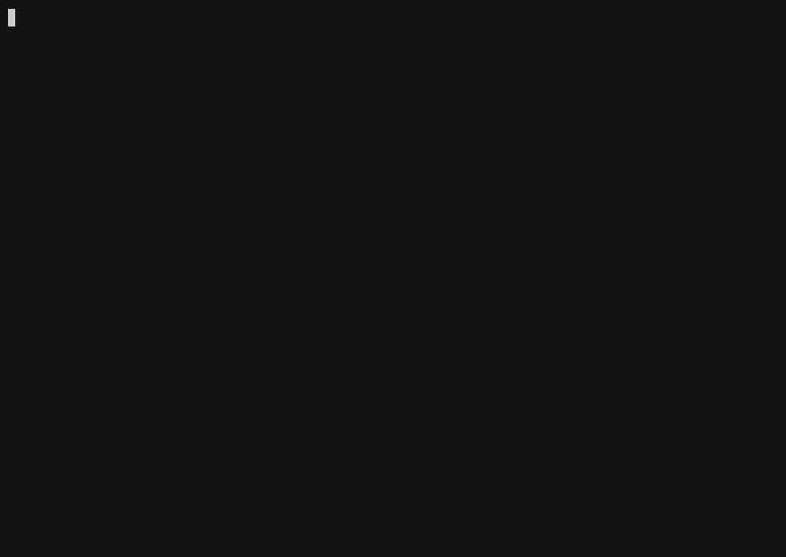

# claude-deck

**A lean, terminal-native TUI for running and managing multiple Claude Code sessions at once.**

Open it, get greeted, and spin up as many `claude` sessions as you want — each in its own folder — switching between them from a single sidebar without juggling terminal tabs. It runs *inside* your terminal (no window, no web UI) and wraps the **real** `claude` CLI, so you keep every Claude Code feature and your own config, on your existing subscription.

<p align="center">
  
</p>

## Why

Running several Claude Code sessions means several terminal windows, each a full runtime, and no single place to see what's running, what's done, and what's waiting on you. `claude-deck` is one lightweight process that manages them all: a session sidebar with live state, and a warm Home screen to launch from — instead of being dropped into a session you didn't pick.

It does **not** reimplement Claude Code. Every session is the real `claude` binary in a pseudo-terminal, so skills, MCP servers, slash commands, subagents, plan mode, your `settings.json` and `CLAUDE.md` — all of it just works, and it stays current with Claude Code automatically.

## Install & run

Requires [Rust](https://rustup.rs) and the `claude` CLI installed and logged in.

```bash
git clone https://github.com/88871/claude-deck
cd claude-deck
cargo run            # or: cargo build --release  →  ./target/release/claude-deck
```

You'll land on the **Home** screen. Press `Ctrl-a n`, pick a folder, and you're in a real Claude Code session.

## Keys

Everything is driven by a **leader key** — press `Ctrl-a`, release, then a command. Anything you type *without* the leader goes straight to the focused session.

| Keys | Action |
|------|--------|
| `Ctrl-a` `n` | New session — prompts for a folder |
| `Ctrl-a` `1`–`9` | Focus session by number |
| `Ctrl-a` `[` / `]` | Previous / next session |
| `Ctrl-a` `h` | Back to the Home screen |
| `Ctrl-a` `r` | Rename the focused session |
| `Ctrl-a` `x` | Kill the focused session |
| `Ctrl-a` `q` | Quit |

**Mouse** works too: click a sidebar row to focus it, scroll the sidebar to cycle, and click/scroll inside a session to interact with Claude.

## Sessions & states

Each session shows a colored state icon in the sidebar:

| Icon | State |
|------|-------|
| green | running |
| yellow | waiting on you |
| dim | idle / closed |
| red | error |

## Icons & fonts

The UI uses **Nerd Font icons** by default (the  home glyph, folder icons, state dots). If your terminal isn't using a [Nerd Font](https://www.nerdfonts.com/), run with a clean Unicode fallback instead:

```bash
claude-deck --ascii          # or set CLAUDE_DECK_ICONS=ascii
```

## How it works

```
┌─ claude-deck (one process) ──────────────────────────────┐
│  ratatui + crossterm  ──────  sidebar + focused pane      │
│  each session: portable-pty → real `claude` → vt100 → UI  │
└───────────────────────────────────────────────────────────┘
```

Built in Rust with [`ratatui`](https://ratatui.rs), [`crossterm`](https://github.com/crossterm-rs/crossterm), [`portable-pty`](https://github.com/wez/wezterm/tree/main/pty), [`vt100`](https://github.com/doy/vt100-rust), and [`tui-term`](https://github.com/a-kenji/tui-term). The pane-emulation layer is isolated so it can be swapped for a higher-fidelity engine later.

## Roadmap

- Hook-driven precise states (waiting-on-you / idle via Claude Code hooks)
- Idle-session reaping + resume (`claude --resume`) to reclaim memory
- Scrollback / copy mode
- Recent-folders on the Home screen

## Status

Early but working: launches to Home, runs multiple real `claude` sessions in a sidebar, mouse + keyboard driven, colors and Nerd Font icons. Contributions welcome.
